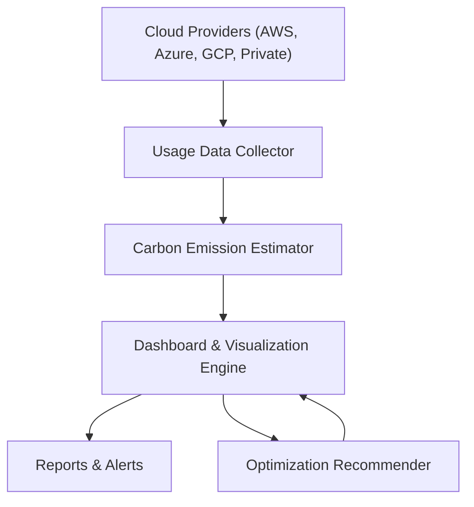

# RANTAI GreenCloud

Cloud Carbon Footprint Tracker for Sustainable Web3

RANTAI GreenCloud adalah sistem untuk mengukur, memonitor, dan memvisualisasikan jejak karbon dari penggunaan infrastruktur cloud publik maupun privat.
Proyek ini jadi bagian dari inisiatif RANTAI Sustainable Web3, mendukung komunitas RANTAI untuk transparansi dan keberlanjutan.

---

## Core Features

- Cloud Resource Usage Monitoring
Integrasi data pemakaian compute, storage, dan network dari AWS, Azure, Google Cloud, dan private cloud.

- Carbon Emission Estimation
Kalkulasi emisi karbon berdasarkan penggunaan resource dengan faktor emisi berbeda per penyedia cloud & region.

- Dashboard Visualisasi
Grafik penggunaan energi, emisi per layanan/konten, tren historis, dan benchmarking antar proyek.

- Optimization Recommendations
Saran pengurangan emisi: auto-scaling, pemilihan region hijau, scheduling workload.

- Reporting & Alerts
Laporan periodik & notifikasi otomatis ketika emisi melewati ambang batas.

---

## Flow Diagram

---

## Kontribusi

Kontribusi sangat kami sambut! Silakan ikuti langkah berikut:

- Fork repository

- Buat branch fitur baru: git checkout -b feature/nama-fitur

- Commit perubahan Anda: git commit -m 'Tambah fitur baru'

- Push ke branch Anda: git push origin feature/nama-fitur

- Buat pull request di repository ini

- Harap pastikan kode teruji dan mengikuti style yang sudah ada.

---

## Lisensi

Proyek ini dilisensikan di bawah MIT License - baca file LICENSE untuk informasi lebih lanjut.
